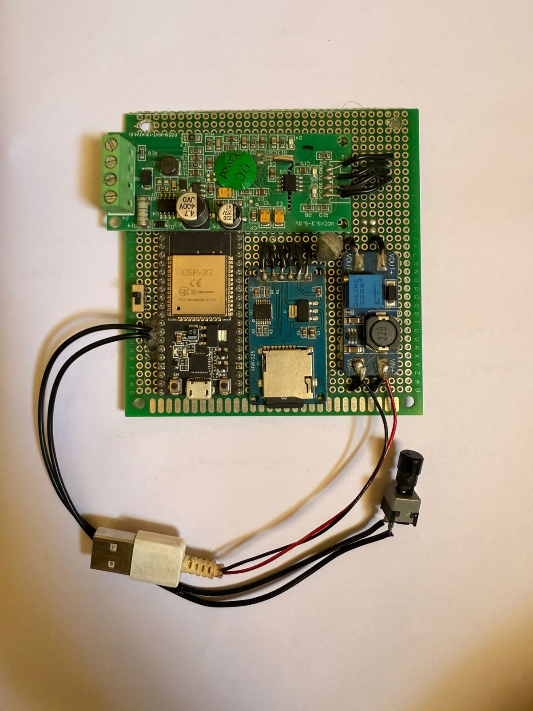

# Smart EB - ESP32 Energy Monitoring System

An IoT-based energy monitoring system built with an ESP32 and PZEM-004T module to measure voltage, current, power, frequency, power factor, and energy consumption in real time. The system supports MQTT telemetry, offline SD card logging, Wi-Fi status indication, and relay-based load management.



## Key Features

* **Real-time electrical monitoring:** Reads voltage, current, power, energy, frequency, and power factor from the PZEM-004T energy meter.
* **ESP32-based IoT connectivity:** Uses Wi-Fi to send readings to an MQTT broker for remote monitoring.
* **Offline data logging:** Stores readings on a microSD card when network connectivity is unavailable.
* **Batch upload support:** Preserves offline readings and uploads them later when Wi-Fi/MQTT connectivity returns.
* **Relay-based load control:** Includes relay output support for basic load management.
* **Wi-Fi status LED:** Uses LED patterns to show connected, disconnected, and connecting states.

## Hardware Stack

* ESP32 development board
* PZEM-004T energy meter module
* Current transformer coil
* SD card module and microSD card
* Latching relay
* 5V power supply
* Reset switch
* Jumper wires, terminal blocks, and prototype board

## System Flow

1. ESP32 connects to Wi-Fi and initializes MQTT, SD card, and PZEM sensor interfaces.
2. PZEM-004T samples live electrical parameters from the connected load.
3. Readings are published to MQTT when the network is available.
4. If the network is unavailable, readings are stored on the SD card.
5. Stored readings are batch-uploaded when connectivity is restored.
6. LED patterns provide quick field diagnostics for Wi-Fi state.

## Repository Contents

```text
.
├── Smart EB Code.docx
├── Smart EB Components.docx
├── Smart EB image.docx
├── docs/
│   └── images/
│       ├── project-1.jpeg
│       └── project-2.jpeg
└── README.md
```

## Skills Demonstrated

Embedded C++, ESP32, PZEM-004T energy sensing, MQTT, SD card logging, offline-first telemetry, relay control, Wi-Fi provisioning, and hardware debugging.

## Notes

The original code, component list, and project images are included as Word documents. The extracted images in `docs/images/` are provided so the project can be viewed directly on GitHub.
